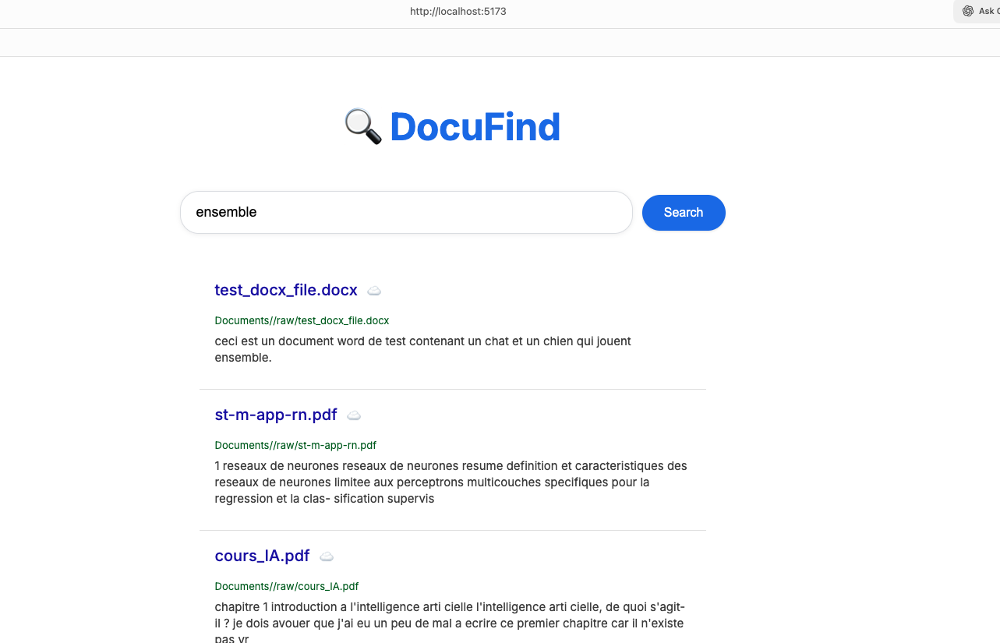
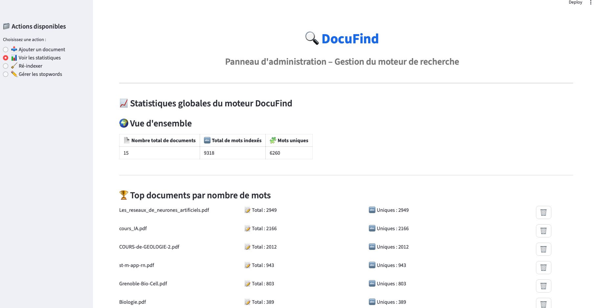

#  DocuFind — Mini Moteur de Recherche

DocuFind est un mini moteur de recherche full-stack permettant d'indexer des documents (TXT, PDF, DOCX, HTML), d'effectuer des recherches avancées (OU, ET, normalisation linguistique), de visualiser les statistiques, et d'explorer les mots-clés via un Word Cloud interactif.

##  Fonctionnalités principales

###  Recherche intelligente

- Recherche par mots simples ou multiples
- Support automatique de **et** / **ou**
- Normalisation linguistique :
  - Minuscules
  - Nettoyage
  - Lemmatisation française (spaCy)
- Suggestions intelligentes en cas de fautes (distance de Levenshtein)

###  Formats supportés

- `.txt`
- `.pdf`
- `.docx`
- `.html`

###  Word Cloud dynamique

- Taille des mots proportionnelle à leur fréquence
- Couleurs et rotation aléatoires
- Clic sur un mot ➝ rempli automatiquement la barre de recherche

###  Dashboard Admin (Streamlit)

- Vue globale : nb de documents, mots totaux, mots uniques
- Statistiques par document
- Suppression complète (DB + fichier)
- Ré-indexation totale
- Gestion des stopwords
- Upload multiple

##  Aperçu de l'application

###  Page de recherche (Frontend React)



###  Tableau de bord d'administration (Streamlit)



##  Architecture du projet

```
DocuFind/
│── backend/
│   ├── main.py                # API FastAPI
│   ├── admin.py               # Dashboard Streamlit
│   ├── search_engine.db       # Base SQLite
│   ├── documents/             # Documents indexés
│   └── stopwords.txt          # Stopwords personnalisables
│
│── frontend/
│   ├── src/
│   │   ├── components/
│   │   ├── pages/
│   │   ├── services/api.ts
│   │   └── styles/
│   └── index.html
```

## ▶ Installation & Exécution

### 1️ Backend — API FastAPI

```bash
cd backend
uvicorn main:app --reload --port 8000
```

### 2️ Dashboard Admin (Streamlit)

```bash
streamlit run admin.py
```

### 3️ Frontend React (Vite)

```bash
cd frontend
npm install
npm run dev
```

##  Ré-indexer les documents

Depuis le dashboard admin (menu : "Ré-indexer") :

- Supprime les anciens index
- Relit tous les fichiers
- Applique la normalisation + lemmatisation
- Met à jour les tables SQLite

##  Suppression d'un document

Un clic sur l'icône corbeille :

- Supprime la ligne dans la table `documents`
- Supprime les entrées associées dans `word_frequencies`
- Supprime le fichier du répertoire `/documents`

##  Technologies Utilisées

### Backend

- **FastAPI**
- **SQLite**
- **spaCy** (fr_core_news_sm)
- **python-Levenshtein**
- **pdfminer.six**, **python-docx**

### Frontend

- **React + Vite**
- **TypeScript**
- **CSS custom**
- Système de Word Cloud dynamique interactif

### Admin

- **Streamlit**

##  Contribution

Les contributions sont les bienvenues : optimisations, nouvelles fonctionnalités, améliorations UI/UX…

##  Licence

Projet académique — libre d'utilisation dans un cadre pédagogique.
